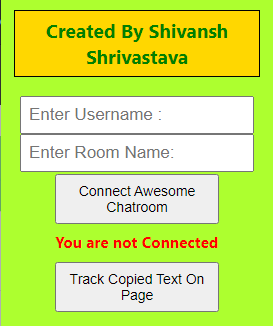
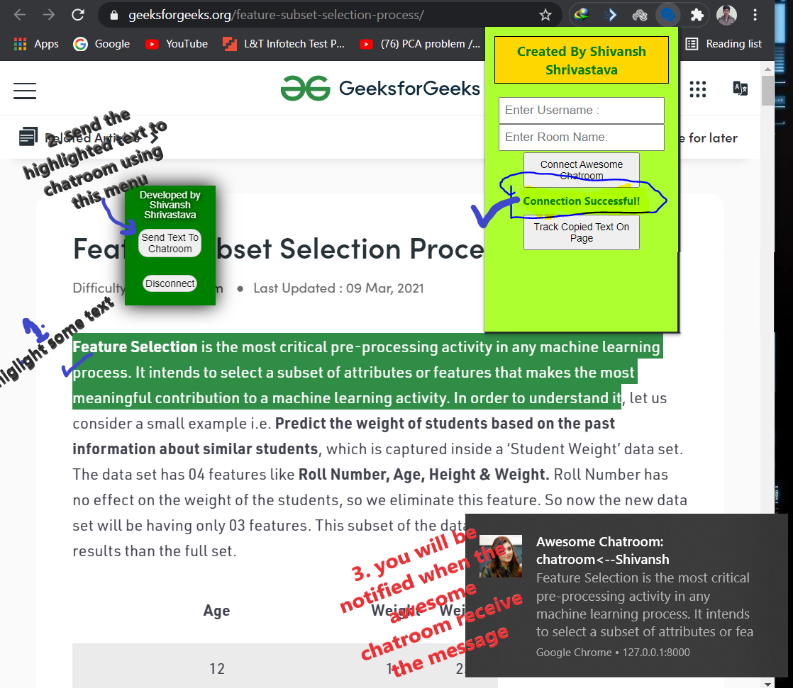

    <h1 style="background-color:green;padding:10px">
        Chatroom Chrome Extension
    </h1>

## For the what this extension is ?

This Chatroom Chrom Extension is developed for improving the Chatroom features and making it more interactive with the users. There is an option for connecting the chatroom with the any page that you are in. Suppose you are on facebook.com and when you press connect with awesome chatroom button then it will make a websocket request to awesome chatroom which in turn gives the connection back. In this way connection between the facebook.com and the awesome chatroom will be created. Now using this connection I have added two features. one of them let you send direct message to charoom from facebook.com(say) i.e. if you highlight some text and click on send message to chat then the highlighted text will be sent to the awesome chatroom and the other feature is that if you enable track copie text on the webpage then any webpage which you will be visiting, the extension will keep track text that is in you clipboard and match with the text which is in website facebook.com in our case and when it found the text on facebook.com then it will highlight that text and scroll you to there.

## How to use ?

    
    

    1. Write username which you have already created on Awesome Chatroom(its another project that I have developed and its also available on my github repo you can check it out)  
    2. Enter room name to which you want to send messages after connection  
    3. Now click on connect button and then open a new webpage say google.com  
    4. there you will see an option menu which the extension will provide  
    5. Now on google.com or any other site highlight some text using your mouse's cursor and after highlighting click on send text to chatrooom and then you will recieve a notification with the message that you sent.  

